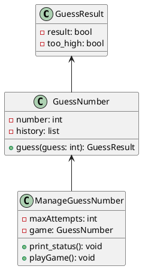

# Guess Number

```plantuml
@startuml
class GuessResult {
  -result: bool
  -too_high: bool
}

class GuessNumber {
  -number: int
  -history: list
  +guess(guess: int): GuessResult
}

class ManageGuessNumber {
  -maxAttempts: int
  -game: GuessNumber
  +print_status(): void
  +playGame(): void
}

GuessResult <-- GuessNumber
GuessNumber <-- ManageGuessNumber
@enduml

```