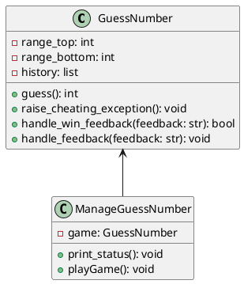

# Computer Guess Number

```plantuml
@startuml
class GuessNumber {
  -range_top: int
  -range_bottom: int
  -history: list
  +guess(): int
  +raise_cheating_exception(): void
  +handle_win_feedback(feedback: str): bool
  +handle_feedback(feedback: str): void
}

class ManageGuessNumber {
  -game: GuessNumber
  +print_status(): void
  +playGame(): void
}

GuessNumber <-- ManageGuessNumber
@enduml
```