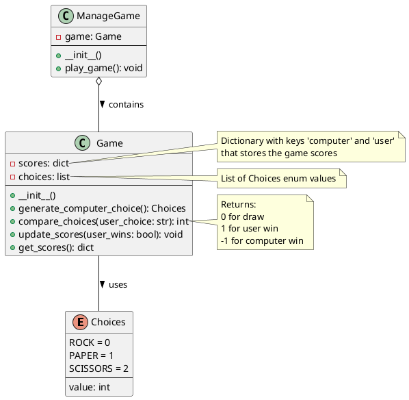

# Computer Guess Number

```plantuml
@startuml
enum Choices {
  ROCK = 0
  PAPER = 1
  SCISSORS = 2
  --
  value: int
}

class Game {
  - scores: dict
  - choices: list
  --
  + __init__()
  + generate_computer_choice(): Choices
  + compare_choices(user_choice: str): int
  + update_scores(user_wins: bool): void
  + get_scores(): dict
}

class ManageGame {
  - game: Game
  --
  + __init__()
  + play_game(): void
}

ManageGame o-- Game : contains >
Game -- Choices : uses >

note right of Game::scores
  Dictionary with keys 'computer' and 'user'
  that stores the game scores
end note

note right of Game::choices
  List of Choices enum values
end note

note right of Game::compare_choices
  Returns: 
  0 for draw
  1 for user win
  -1 for computer win
end note
@enduml
```

