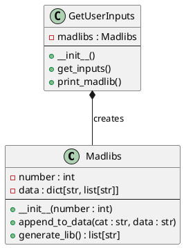

# MadLibs

```plantuml
@startuml
class Madlibs {
    - number : int
    - data : dict[str, list[str]]
    --
    + __init__(number : int)
    + append_to_data(cat : str, data : str)
    + generate_lib() : list[str]
}

class GetUserInputs {
    - madlibs : Madlibs
    --
    + __init__()
    + get_inputs()
    + print_madlib()
}

GetUserInputs *-- Madlibs : creates
@enduml
```