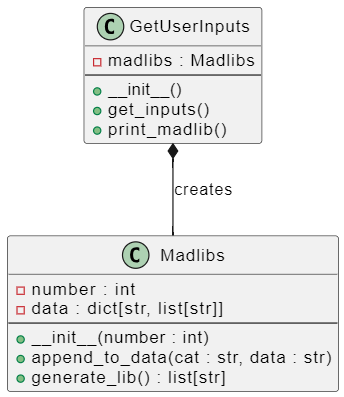

# MadLibs

## Madlibs Class:
- **Purpose**: Manages the data (verbs, adjectives, nouns) and generates the madlib sentences.
- **Key Methods**:
  - `append_to_data(cat, data)`: Appends provided data to the respective category.
  - `generate_lib()`: Randomly shuffles the data and constructs the sentences.

## GetUserInputs Class:
- **Purpose**: Handles user input (or uses STATIC_LIST if AUTO is True) and interfaces with the Madlibs class.
- **Key Methods**:
  - `get_inputs()`: Collects inputs and appends them to the Madlibs instance.
  - `print_madlib()`: Calls generate_lib() and prints the result.

